# Master Control

Master Control (MC) is a local-first runtime for controlled Linux host operations.
It exposes a typed capability layer through an MCP interface, with policy, approval, and audit boundaries around every host action.



MC is not "just the MCP server".
MC is the runtime. MCP is its main integration interface.

MC is built around three constraints:
- typed tools before generic shell access
- explicit confirmation for risky or privileged actions
- local audit trail and repeatable validation

## Current status

- late alpha
- single-host and local-first by design
- install path: source checkout plus `install.sh`
- validated on the maintainer workstation and on a dedicated Debian 13 VPS lab
- main integration interface: experimental read-only MCP stdio
- local administration interface: CLI
- optional interface: chat/provider path
- not positioned as a production-ready Linux administration platform, security auditor, or package manager

This README intentionally stays short.
Operational detail, release records, validation evidence, and planning documents live under [docs/README.md](docs/README.md).

## Quick start

```bash
./install.sh --provider heuristic
~/.local/bin/mc doctor
~/.local/bin/mc tools
~/.local/bin/mc validate-host-profile --output-dir ./artifacts/host-validation
```

Interfaces:

```bash
~/.local/bin/mc mcp-serve
~/.local/bin/mc chat --once "o host esta lento"
```

Remove the user-local install:

```bash
./uninstall.sh --purge-state
```

If `install.sh` reports that `ensurepip` is unavailable on Debian or Ubuntu, install `python3.13-venv` first.

## Current coverage

- host, disk, memory, process, service, and journal inspection
- process-to-`systemd` correlation and failed-service triage
- managed config read, write, backup, and restore inside a constrained policy boundary
- recommendation workflow with explicit approval before risky execution
- repeatable host-profile validation through `mc validate-host-profile`
- optional heuristic, OpenAI, and Ollama-backed planning on top of the same runtime

## Documentation

- [Documentation map](docs/README.md)
- [Current status](docs/status.md)
- [Architecture](docs/architecture.md)
- [Security model](docs/security-model.md)
- [Operator workflows](docs/operator-workflows.md)
- [Provider setup](docs/providers.md)
- [Host-profile validation guide](docs/host-profile-validation.md)
- [Validation evidence](docs/alpha-validation-report.md)
- [Contributing](CONTRIBUTING.md)
