# Diagrams

This directory contains the canonical Mermaid diagrams for the current MC flow.

## Diagrams

- `master-control-flow.mmd` / `master-control-flow.svg`
  - End-to-end request flow across CLI, planning, policy, execution, recommendations, and SQLite state
- `chat-planning-flow.mmd` / `chat-planning-flow.svg`
  - Chat turn lifecycle from message intake to iterative planning, tool execution, and final response
- `recommendation-approval-flow.mmd` / `recommendation-approval-flow.svg`
  - Recommendation lifecycle from session insight derivation to acceptance, confirmation, and action execution
- `state-audit-flow.mmd` / `state-audit-flow.svg`
  - How sessions, summaries, observations, recommendations, messages, and audit events are written and consumed

## Preview

### End-to-end flow

### Chat and planning flow

### Recommendation and approval flow

### State and audit flow

